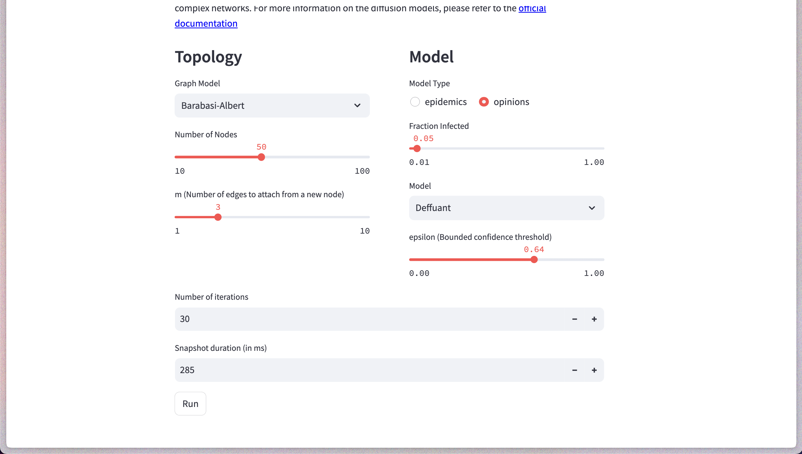

# Diff2GIF – Animated Diffusion Models
[](https://diff2gif.streamlit.app/)
[](https://www.python.org/downloads/release/python-390/)


Create your own animated network visualization by exploiting a diffusion model!


## What is this?
Diff2GIF is a web app that allows you to create animated network visualizations by selecting among several graph topologies and
diffusion models. 
The app is based on [NetworkX](https://networkx.org/), [NDlib](https://ndlib.readthedocs.io/en/latest/) and is built with 
[Streamlit](https://streamlit.io/).




## How do I use it?
You can use the app by clicking on the Streamlit badge above. Alternatively, you can run the app locally by cloning this repository and running the following commands:
```bash
pip install -r requirements.txt
streamlit run app.py
```
To create your own GIF, follow these steps:
1. Select a graph topology (e.g., Erdos-Renyi, Barabasi-Albert, etc.)
2. Select an Epidemic/Opinion diffusion model (e.g., SIR, Deffuant, etc.)
5. Select the number of iterations (i.e., the number of frames of the GIF)
6. Select the duration of the GIF's frames 
7. Click on the "Generate GIF" button and wait for the GIF to be generated 
8. Download and enjoy your GIF!


#### And remember: it's <b>JIF</b>, not <b>GIF</b>!

