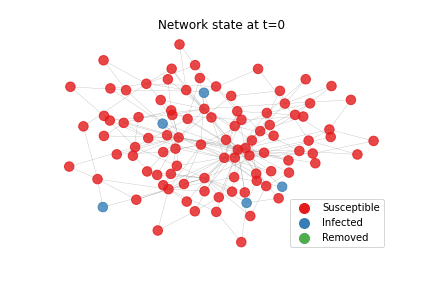

# Diff2GIF-Animated Diffusion Models
 ### Create your own animated network visualization by exploiting a diffusion model!



You can create a GIF as follows

```
# import
from diff2gif import Diff2GIF

# create network
import networkx as nx 

# network diffusion library
#!pip3 install ndlib
import ndlib.models.ModelConfig as mc 
import ndlib.models.epidemics as ep

# Network topology
g = nx.barabasi_albert_graph(50, 2, seed=42)
# Model selection
model = ep.SIRModel(g) # check out other models at 
                       # https://ndlib.readthedocs.io/en/latest/index.html

# Model Configuration
cfg = mc.Configuration()
cfg.add_model_parameter('beta', 0.4)
cfg.add_model_parameter("gamma", 0.1)
cfg.add_model_parameter("fraction_infected", 0.1)
model.set_initial_status(cfg) 


class Params:
    model = model
    n_iters = 20
d2g = Diff2GIF(g, Params)
d2g.make('mygif.gif')
```

which produces the following


You can also customize the gif to your likings:
```
model = ep.SIRModel(g)
cfg = mc.Configuration()
cfg.add_model_parameter('beta', 0.4)
cfg.add_model_parameter("gamma", 0.1)
cfg.add_model_parameter("fraction_infected", 0.1)
model.set_initial_status(cfg) 

class Params:
    model = model
    n_iters = 20

    pos = nx.circular_layout(g)
    
    colors = { # check model.available_statuses for possible node statuses
        "Susceptible": "gray",  
        "Infected": "#891414",
        "Removed": "#2d0707",  
        "edges": "#999999",  
    }
    node_size = 200
    alpha = 0.7
    width = 0.1

d2g = Diff2GIF(g, Params)
# you can also change the snapshot duration
d2g.make('mysecondgif.gif', snap_duration=0.1)
```


#### And remember: it's <b>JIF</b>, not <b>GIF</b>!

